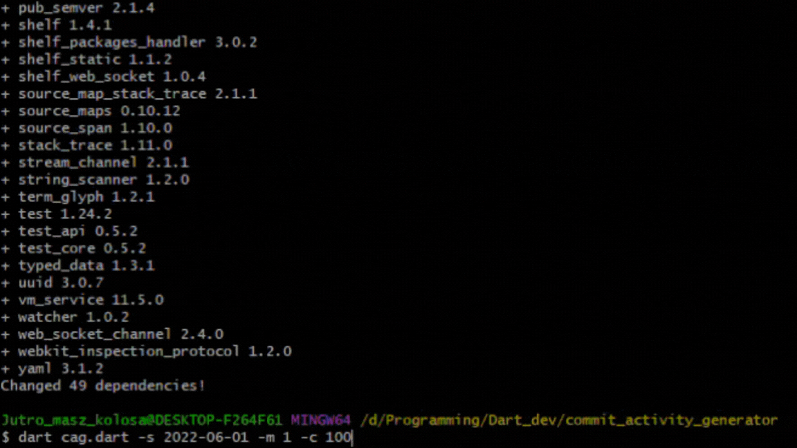

# Git Commit Activity Generator

A Dart command-line application that generates commit activity for a GitHub repository.

## Prerequisites

To use this tool, you must have Dart and Git installed on your machine.

## Installation

1. Clone or download the repository.
2. In the project directory, run the following command to install dependencies:

   `dart pub get`

## Usage

    dart cag.dart [-r <repository>] [-s <start_date>] [-e <end_date>] [-m <max_commits>] [-c <coverage>] [-h] [-v]

## Options

- `-r`, `--repository`: The address of the repository to generate commits for. The repository will be created in the current directory if not specified.
- `-s`, `--start_date`: The day of the first commit. Defaults to yesterday.
- `-e`, `--end_date`: The day of the last commit. Defaults to today.
- `-m`, `--max_commits`: The maximum number of commits per day. Defaults to 10. Must be a positive integer between 1 and 600.
- `-c`, `--coverage`: The percentage of days with at least one commit. Defaults to 70. Must be a positive integer between 1 and 100.
- `-h`, `--help`: Prints help information.
- `-v`, `--version`: Prints version information.

## Example

### #1

    dart cag.dart --repository=https://github.com/OrangeRoot/myrepo.git --start_date=2019-01-01

for short

    dart cag.dart -r https://github.com/OrangeRoot/myrepo.git -s 2019-01-01

Creates local git repository named `myrepo` with commits starting from 2019-01-01 to current date, coverage at 70%, max_commits per day equal to 10, and pushes it to the remote repository at `https://github.com/OrangeRoot/myrepo.git`. Note that the `coverage` and `max_commits` options aren\'t provided here, so the default value is used.

### #2

    dart cag.dart -m 30

Creates local git repository with a random unique name and max_commits per day equal to 30 for yesterday and today.

### #3

    dart cag.dart -h

Prints options description.

### #4

    dart cag.dart -r git@github.com:OrangeRoot/commit_activity_generator_demo.git -s 2021-01-01 -e 2023-05-01 -m 7 -c 50

Result: https://github.com/OrangeRoot/commit_activity_generator_demo.git

## Bonus

Script features the progress bar as it runs.

## License

Tool released under the MIT License.
